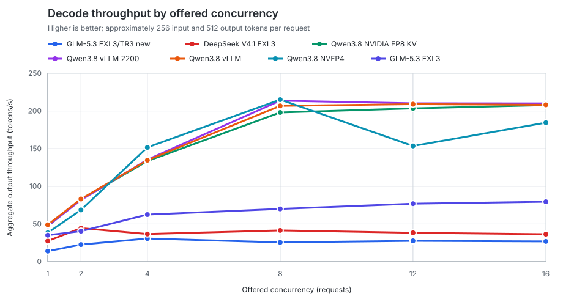
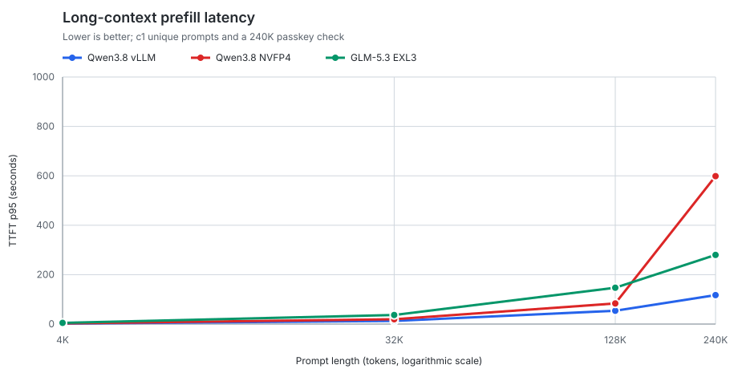
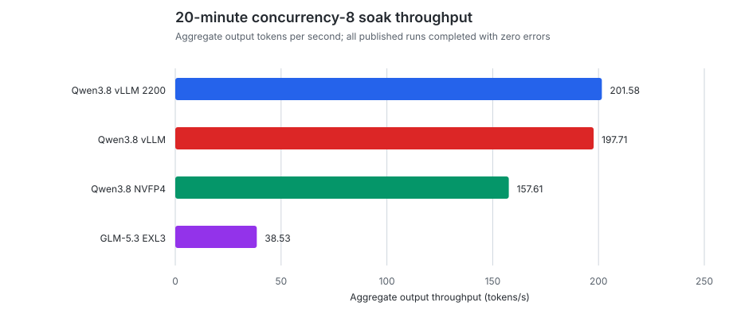

# Published benchmark results

This page compares the curated, sanitized baselines in this repository. It is
generated from [`catalog.json`](catalog.json) so new results can extend the
same tables and charts without hand-editing this page.

Last updated: 2026-08-29 · Published baselines: 2

## At a glance

| Model | Hardware / runtime | Native context | Peak decode tok/s | c1 TTFT p95 | Longest-context TTFT p95 | Soak tok/s | Quality | Recommended concurrency | Recipe credit |
|---|---|---:|---:|---:|---:|---:|---:|---|---|
| [Qwen3.8-Flash-Next-NVFP4](2026-08-29-qwen38-flash-next-nvfp4-native-262k.md) | 2x DGX Spark / SGLang | 256K | 215.06 @ c8 | 0.41s | 598.56s | 157.61 | 13/13 | Concurrency 8 | [Qwen3.8 Flash Next DGX Spark recipe](https://github.com/tomrhudson/qwen38-flash-next-dgx-spark-recipe/tree/main) |
| [GLM-5.3-Flash-EXL3](2026-08-29-glm53-flash-exl3-native-1m.md) | 2x DGX Spark / vLLM | 1M | 79.51 @ c16 | 0.95s | 279.80s | 38.53 | 13/13 | Concurrency 1 interactive; 4 batch | [MiaAI-Lab original recipe](https://github.com/MiaAI-Lab/GLM-5.3-Flash-EXL3-2x-DGX-Sparks/tree/79f10b91f84779b2b1ff2c9327b1a5847cd97f70) |

Peak decode throughput is useful for batch capacity; c1 TTFT is the better
interactive-latency signal. The longest-context column uses the largest shared
prefill scenario available in the standard suite (currently 240K tokens).

## Decode scaling

Each point uses approximately 256 input tokens and a forced 512-token completion.
Concurrency above the server's active-sequence limit includes queueing.

## Long-context prefill

The prompt-length axis is logarithmic. Lower TTFT is better; every plotted
long-context passkey result was correct.

## Sustained load

The soak comparison uses the standard 20-minute concurrency-8 workload. Consult
the linked baseline report for TTFT tails, request counts, and model-specific
operational interpretation.

## Adding another baseline

1. Run the standard suite under comparable hardware, prompt, sampling, and
   token-budget conditions.
2. Review and sanitize the generated output into a curated Markdown report;
   keep raw JSON and generated reasoning private.
3. Add one structured entry to `results/catalog.json`, including any recipe
   credit and the metrics used here.
4. Run `python3 scripts/generate_results_summary.py`, then
   `python3 -m unittest discover -s tests -v`.

The generator validates report links and catalog IDs, then rewrites this page
and the SVG assets deterministically. `--check` verifies that committed output
is current without changing files.

## Comparison limits

- These are serving-system results, not general model-quality rankings.
- Hardware, runtime, quantization, cache state, and active-sequence limits can
  materially change throughput and latency.
- Quality canaries catch obvious serving regressions; they are not a broad
  capability evaluation.
- Read the individual report before drawing conclusions from a single chart.
